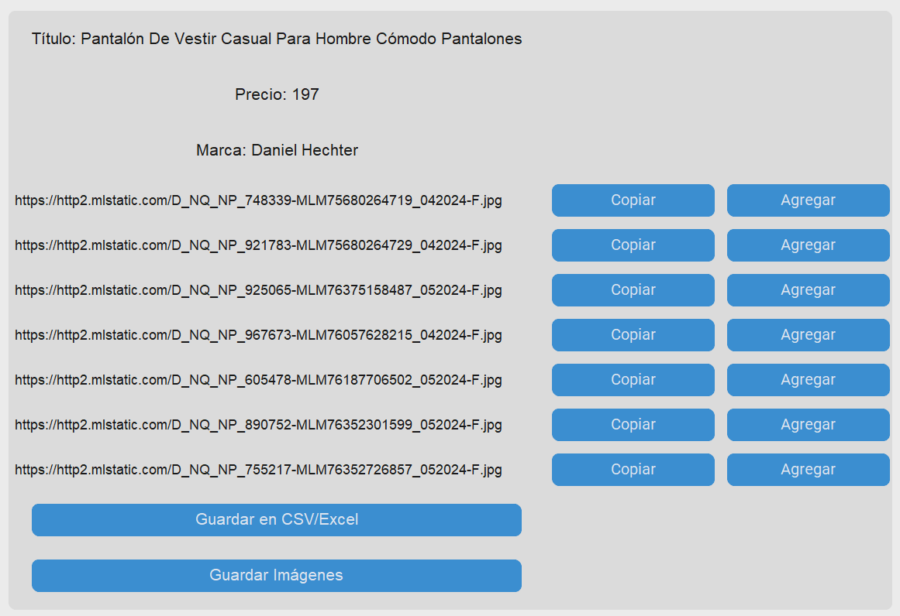

# **Mercado Libre Scraper**

## Overview
This Python application is designed to streamline the process of gathering product information from Mercado Libre for business owners looking to populate their Facebook Marketplace catalogs. It automates the tedious tasks of web scraping, image downloading, and URL copying, thereby saving time and reducing manual effort. Utilizing Tkinter for its GUI, the application provides an intuitive interface for users to efficiently obtain essential product data.

##Features
* **Web Scraping from Mercado Libre**: Automatically extracts detailed product information, including names, and prices, prices.
* **Image Downloading**: Downloads product images directly from Mercado Libre listings and saves them into a locally created folder.
* **URL Copying**: Copies image URLs to the clipboard, making it easy to upload them to Facebook Marketplace or any other online selling platform.

## Contributing
Contributions to improve the application are welcome. Please follow the standard GitHub pull request process if you have features or improvements you'd like to add.

## License

## Disclaimer
This tool is intended for personal and educational use only. Please respect Mercado Libre's terms of service and use this application responsibly. The developers are not responsible for any misuse or damage caused by this software.
