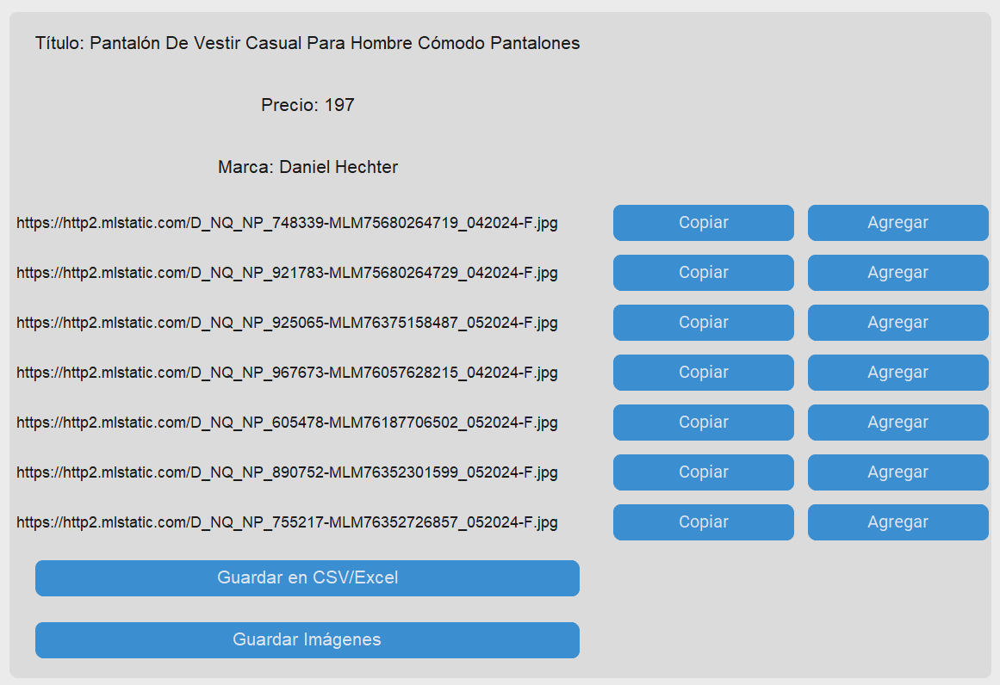

## 🛠️ Tools and Technologies Used

## 📋 Application Features

### 1. **Extract and Display Data**

- The application scrapes specified web pages for data including the title, price, brand, and images. It uses BeautifulSoup to parse the HTML content and extract relevant information.

### 2. **Save Data to CSV or Excel**

- Users can save the scraped data into CSV or Excel files directly from the application. The application allows for concatenating new data to existing files, making it easy to keep an ongoing record of scrapped information.

### 3. **Download Images**

- Scraped images can be downloaded to a specified directory. Users can select the directory where images will be saved, and all images from the scrape session will be downloaded.

## 🖥️ User Interface

The application features an intuitive graphical user interface (GUI) built with CustomTkinter. Users input the URL of the page they wish to scrape and can manage the scraping process through clearly labeled buttons and options.

### Screenshot of the Application

## 📝 Example Usage

1. **Enter the URL**: Input the URL of the webpage you want to scrape.
2. **Specify the Name**: Provide a name that will be associated with the scraped data.
3. **Scrape Data**: Click the "Accept" button to start the scraping process. The application will extract the title, price, brand, and image URLs from the webpage.
4. **Save Data**: Use the "Save to CSV/Excel" button to export the scraped data into a CSV or Excel file.
5. **Download Images**: Click "Save Images" to download all extracted images to your chosen directory.

## 🔧 How It Works

1. **Web Scraping with BeautifulSoup**: The application sends HTTP requests to the specified URL and parses the HTML content to extract the desired data.

2. **Data Manipulation with Pandas**: Extracted data is organized into dataframes using Pandas, allowing for easy data manipulation and export.

3. **GUI with CustomTkinter**: CustomTkinter provides a user-friendly interface for interacting with the application, making it accessible even for those without technical expertise.

* * *

## 🚀 **Explore More Projects!**

### [📚 Check out all my projects on GitHub Pages](https://alxmares.github.io)

* * *
